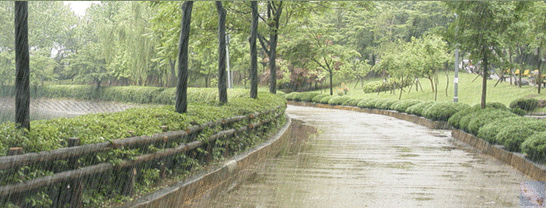

Hi & Welcome to RainMan

I built this word game as a project to continue sharpening my skills in javascript, vanilla css, and HTML. To play is very simple. Open the HTML file on a web browser and the game will automatically begin. The black dashes at the top of the screen are the amount of letters in the random word you've been tasked to discover. Each game gives the user a total of five (5) trys. If the wrong letter is chosen, an image of RainMan will appear but remember, RainMan's progression towards doom all depends on the user's wrong inputs. 

Whether you win or lose, users can always hit the reset button to fetch a new word.

Enjoy!